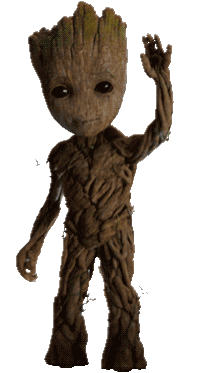

# **Hi, I'm César Nóvoa** 

_Frontend Engineer | React & Design Systems_

<!--
[](https://www.linkedin.com/in/cesar-novoa/)
[](https://cesar-novoa.github.io)

--- -->

## Resume

- [View CV (Markdown)](./docs/cv.md)
- [Download CV (PDF)](./docs/cv.pdf)

## Projects

- [ARTCLO](https://github.com/cesar-novoa/ARTCLO) -> WIP – experimenting with Astro to create an e-commerce concept
- [Community](https://github.com/cesar-novoa/Community) -> Full Stack BootCamp Final Project

<!-- [My Web](https://cesar-novoa.github.io) -> Portfolio Web -->

## Something about me

```js
let rasek = {
  code: ["JavaScript", "TypeScript", "PHP", "Python"],
  askMeAbout: ["frontend dev", "UI/UX", "design systems", "graphic design"],
  studies: ["Graphic Design", "Full Stack Development Bootcamp"],
  technologies: {
    frontEnd: ["React", "Redux", "Vite", "TailwindCSS", "Astro", "Next.js"],
    backEnd: ["Node.js", "Express"],
    databases: ["MySQL", "PostgreSQL"],
    devOps: ["GitLab CI/CD", "GitHub Actions"],
  },
  currentFocus: "Building scalable, accessible frontends and design systems",
};
```

💬**Feel free to say hi** if you want to talk about web development, design, or just connect!

---

### Contact

- [LinkedIn](https://linkedin.com/in/cesar-novoa)
- [Email](mailto:novoafernandezcesar@gmail.com)

---

⌨️ with ❤️ by [César Nóvoa](https://github.com/cesar-novoa) 😊
